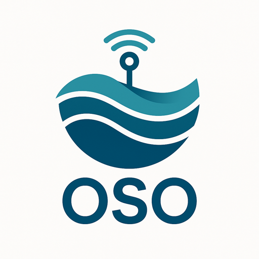

#  Observatories of Seas Ontology (OSO)

## 📖 Overview

**OSO (Observatories of Seas Ontology)** provides a semantic framework to describe **marine observatories**, including those operated by **EMSO ERIC** as well as other observatories managed by national nodes such as **EMSO-France** or developed within research projects.

Version **1.0.0** represents the **first stable release** of the ontology, consolidating previous developments and improving FAIR metadata, semantic interoperability, and alignment with reference ontologies.

The ontology supports the **FAIR management, discovery, and reuse of marine observation data**.

---

## 📂 Access

- **Ontology IRI**: https://w3id.org/earthsemantics/OSO  
- **Documentation (HTML)**: https://emso-eric.github.io/oso-ontology/  
- **WebVOWL visualisation of the OSO ontology**: https://service.tib.eu/webvowl/#iri=https://earthportal.eu/ontologies/OSO  
- **EarthPortal entry**: https://earthportal.eu/ontologies/OSO
- **SPARQL endpoint (Virtuoso)**: coming soon

---

## 🧭 Objectives

OSO aims to:

- Provide a **common vocabulary** for describing marine observatories and their components  
- Enhance **interoperability across European marine research infrastructures**  
- Support **data publication and discovery in FAIR-compliant data portals**  
- Enable **semantic interoperability between marine data infrastructures**  
- Align with widely adopted ontologies and standards  

---

## ✨ Highlights of version 1.0.0

- First **stable release** of the ontology  
- Improved ontology metadata and FAIR compliance  
- Alignment with reference ontologies (**FOAF, DCAT, CERIF, PROV-O**)  
- Enriched multilingual metadata  
- Extended instances describing EMSO observatories and platforms  
- Improved provenance metadata and ontology documentation  
- Explicit documentation of the ontology engineering workflow

## 🔎 Knowledge Graph Access

OSO will soon be available through a public **SPARQL endpoint** backed by a **Virtuoso triplestore**.

This service will allow users to:

- query the ontology and its instances using SPARQL
- explore relationships between observatories, sites, platforms and projects
- integrate OSO within semantic data infrastructures.

The endpoint URL will be announced in a future release.

---

## 📋 FAIRisation Roadmap

This ontology is progressively aligned with the **FAIR principles** using the  
[O'FAIRe evaluation framework](https://catalogue.fair-impact.eu/resources/ofaire).

🧪 **Current FAIR score** (updated dynamically):  
https://earthportal.eu/ajax/fair_score/html/?ontologies=OSO

Feedback and contributions are welcome to further improve FAIR compliance.

---

## 📦 Download & Examples

The ontology can be accessed directly via its persistent IRI or downloaded in several formats.

**SPARQL access**

A SPARQL endpoint providing access to the OSO knowledge graph will be available soon.

**Main access**

- Turtle (.ttl): https://w3id.org/earthsemantics/OSO

**Alternative formats**

- RDF/XML: https://earthportal.eu/ontologies/OSO.rdf  
- OWL/XML: https://earthportal.eu/ontologies/OSO.owl  
- CSV export: https://earthportal.eu/ontologies/OSO.csv  
- Ontology diff: https://earthportal.eu/ontologies/OSO.diff  

📊 **Excel extraction**

https://github.com/emso-eric/oso-ontology/blob/main/extraction/OSO_RF_Site_Platform_Filtered_EMSO_20250723.xlsx

🌐 **Explore the ontology**

https://earthportal.eu/ontologies/OSO

---

## 🧬 Structure & Key Concepts

### Hierarchical model

RegionalFacility
 └─ Site
     └─ SubSite
         └─ Platform
             └─ SubPlatform

### Key classes

`RegionalFacility`, `Site`, `SubSite`, `Platform`, `SubPlatform`,  
`ResearchInfrastructure`, `Organisation`, `Project`, `Cruise`,  
`Discipline`, `Person`, `Geometry`, `BoundingBox`

These classes describe the organisational and technical components of marine observatories.

### Ontology aligns with and reuses concepts from

| Vocabulary | Purpose |
|---|---|
| `dcterms:` | Metadata and resource description |
| `foaf:` | Organisations and persons |
| `schema:` | Web data interoperability |
| `geo:` / `wgs84_pos:` | Geospatial coordinates |
| `sosa:` / `ssn:` | Sensors and observations |
| `prov:` | Provenance tracking |
| `cerif:` | Research infrastructures and organisations |

This reuse improves **semantic interoperability across marine data systems**.

---

## 🔧 Versioning

OSO follows the **Semantic Versioning (SemVer)** specification.

Version format:

MAJOR.MINOR.PATCH

### Meaning

| Version type | Meaning |
|---|---|
| MAJOR | incompatible ontology changes |
| MINOR | backward-compatible ontology extensions |
| PATCH | corrections, metadata improvements, or documentation updates |

Example:

0.17 → 1.0.0

---

## 🛠 Development Workflow

The ontology is developed collaboratively within the **EMSO Data Management Service Group (DMSG)**.

The engineering workflow includes:

- ontology modelling with **Protégé**
- ontology editing and validation using **VSCodium**
- version control and collaboration through **GitHub**
- iterative alignment with reference ontologies
- FAIRness evaluation using **O'FAIRe**

---

## 🧾 Commit Convention

This repository follows the **Conventional Commits** specification.

Examples:

feat: add Organisation alignment with CERIF  
fix: correct domain of oso:containsSite  
docs: update ontology metadata  
refactor: reorganise platform hierarchy  

This convention improves **traceability and changelog generation**.

---

## 🤝 Contribute / Contact

Contributions are welcome.

You can:

- open a GitHub issue  
https://github.com/emso-eric/oso-ontology/issues  

- report modelling issues  
- suggest ontology improvements  
- contribute to ontology extensions  

Contact the **EMSO Data Management Service Group**

📧 emso.dmsg@emso-eu.org

---

## 📝 License

This ontology is released under the **Creative Commons Attribution 4.0 (CC-BY 4.0)** license.

https://creativecommons.org/licenses/by/4.0/

When reusing OSO please cite:

OSO – Observatories of Seas Ontology.  
EMSO ERIC / Ifremer.  
FAIRsharing: 10.25504/FAIRsharing.654931

---

## 🙏 Acknowledgements

OSO is developed collaboratively within the **EMSO Data Management Service Group (DMSG)** and benefits from contributions and feedback from the **EMSO ERIC community**.
