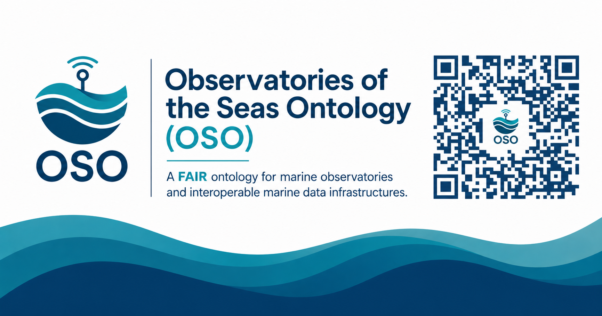
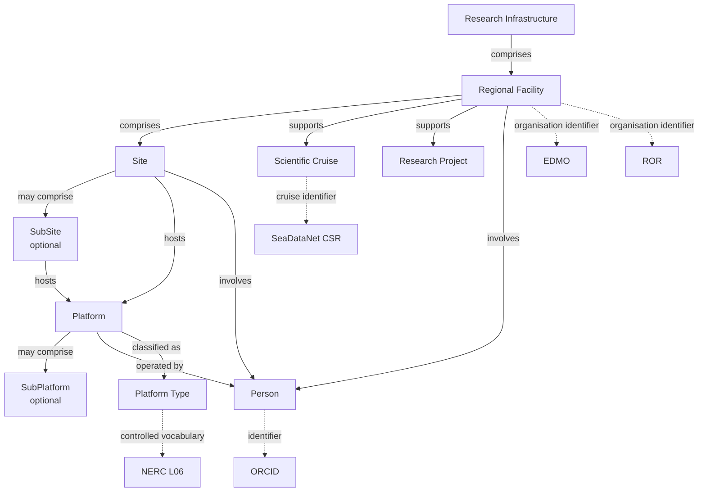

<h1 align="center">
Observatories of the Seas Ontology (OSO)
</h1>

<p align="center">
<b>A FAIR, multilingual and interoperable ontology for marine observatories, ocean observing systems and marine research infrastructures.</b>
</p>

<p align="center">
  
</p>

<p align="center">
OSO enables semantic interoperability across marine observatories, ocean observing systems and research infrastructures by connecting organisations, observatories, platforms, projects, scientific campaigns and datasets using Linked Open Data principles.
</p>

---

<b>🌐 Persistent IRI</b>&nbsp;
<a href="https://w3id.org/earthsemantics/OSO">
https://w3id.org/earthsemantics/OSO
</a>

<b>📦 Publish &amp; Cite</b>&nbsp;
<a href="https://github.com/emso-eric/oso-ontology"></a>
<a href="https://github.com/emso-eric/oso-ontology/releases">
  
</a>
<a href="https://doi.org/10.5281/zenodo.19497913"></a>
<a href="https://archive.softwareheritage.org/swh:1:dir:e887186ed48167fae4ee4d36206bc85df8fefe52;origin=https://github.com/emso-eric/oso-ontology;visit=swh:1:snp:fa1599aaf1ba5484554bb3956942fdb19c88b0f4;anchor=swh:1:rev:3e66d88657d483d3c2df62e9fe4a89d6db69a508">
  
</a>
<a href="https://creativecommons.org/licenses/by/4.0/"></a>
<br>

<b>🔎 Discover</b>&nbsp;&nbsp;&nbsp;&nbsp;&nbsp;&nbsp;&nbsp;&nbsp;
<a href="https://earthportal.eu/ontologies/OSO"></a>
<a href="https://lov.linkeddata.es/dataset/lov/vocabs/oso"></a>
<a href="https://doi.org/10.25504/FAIRsharing.654931"></a>
<br>

<b>📚 Explore</b>&nbsp;&nbsp;&nbsp;&nbsp;&nbsp;&nbsp;&nbsp;&nbsp;&nbsp;&nbsp;
<a href="https://emso-eric.github.io/oso-ontology/"></a>
<a href="https://service.tib.eu/webvowl/#iri=https://w3id.org/earthsemantics/OSO"></a>
<a href="https://virtuoso.ifremer.fr/oso/sparql"></a>
<br>

<b>🌐 Standards</b>&nbsp;&nbsp;&nbsp;&nbsp;&nbsp;&nbsp;&nbsp;&nbsp;
<a href="https://www.w3.org/RDF/" target="_blank"></a>
<a href="https://www.w3.org/TR/owl2-overview/" target="_blank"></a>
<a href="https://www.w3.org/TR/skos-reference/" target="_blank"></a>
<a href="https://www.w3.org/TR/vocab-dcat-3/" target="_blank"></a>
<a href="https://www.w3.org/TR/void/" target="_blank"></a>
<a href="https://opengeospatial.github.io/ogc-geosparql/" target="_blank"></a>
<a href="https://xmlns.com/foaf/spec/" target="_blank"></a>
<a href="https://www.w3.org/TR/prov-o/" target="_blank"></a>
<a href="https://www.w3.org/TR/vcard-rdf/" target="_blank"></a>
<a href="https://semiceu.github.io/ADMS/releases/2.00/" target="_blank"></a>

<b>📄 Formats</b>&nbsp;&nbsp;&nbsp;&nbsp;&nbsp;&nbsp;&nbsp;&nbsp;&nbsp;
<a href="https://github.com/emso-eric/oso-ontology/blob/main/versions/1.1.0/OSO.jsonld"></a>
<a href="https://github.com/emso-eric/oso-ontology/blob/main/versions/1.1.0/OSO.ttl"></a>
<a href="https://github.com/emso-eric/oso-ontology/blob/main/versions/1.1.0/OSO.nt"></a>
<a href="https://github.com/emso-eric/oso-ontology/blob/main/versions/1.1.0/OSO.n3"></a>
<a href="https://github.com/emso-eric/oso-ontology/blob/main/versions/1.1.0/OSO.trig"></a>
<a href="https://github.com/emso-eric/oso-ontology/blob/main/versions/1.1.0/OSO.owl"></a>

<b>🚀 Next Steps</b>&nbsp;&nbsp;&nbsp;&nbsp;&nbsp;&nbsp;
<a href="https://www.w3.org/TR/vocab-ssn/"></a>
<a href="https://i-adopt.github.io/"></a>
<a href="https://www.w3.org/TR/shacl/"></a>

---

# Table of Contents

- [Why OSO?](#why-oso)
- [FAIR by Design](#fair-by-design)
- [Ontology Overview](#ontology-overview)
- [Scope](#scope)
- [Getting Started](#getting-started)
- [Documentation and Resources](#documentation-and-resources)
- [Citation](#citation)
- [Contributing](#contributing)
- [License](#license)
- [Acknowledgements](#acknowledgements)

---

# Why OSO?

The **Observatories of the Seas Ontology (OSO)** is a FAIR, multilingual ontology that provides a common semantic model for marine observatories, ocean observing systems and marine research infrastructures.

It enables organisations to describe and interlink infrastructures, observing sites, platforms, scientific campaigns, datasets and people using persistent identifiers, Linked Open Data principles and internationally recognised standards.

Originally developed within the **EMSO Data Management Service Group (DMSG)**, OSO is designed as an open and reusable ontology for the global marine science community.

---

# FAIR by Design

OSO has been designed from the outset according to FAIR and Linked Open Data principles.

| **🟦 Findable**            | **🟩 Accessible**         | **🟨 Interoperable**     | **🟥 Reusable**    |
| :---------------------- | :--------------------- | :-------------------- | :-------------- |
| Persistent IRI (w3id) | SPARQL endpoint         | RDF / OWL / SKOS      | CC BY 4.0            |
| Versioned DOI         | GitHub repository       | GeoSPARQL             | Provenance           |
| EarthPortal           | HTML documentation      | DCAT / VoID           | Rich multilingual annotations        |
| FAIRsharing           | Multiple RDF formats    | NERC Vocabularies     | ORCID attribution         | 
| LOV                   | GitHub Releases         | ROR / EDMO            | Community governance |
|                       |                         | SeaDataNet CSR        |                      |
|                       |                         | Wikidata              |                      |


OSO addresses all four FAIR principles (Findable, Accessible, Interoperable and Reusable) through persistent identifiers, semantic web standards, rich metadata and open dissemination.

OSO has also been independently evaluated using the **[O'FAIRe](https://github.com/agroportal/fairness)** (Ontology FAIRness Evaluator) framework, which provides an objective assessment of ontology FAIRness. The evaluation details are publicly available from the **[OSO EarthPortal page](https://earthportal.eu/ontologies/OSO)**.

Together, these features make OSO a FAIR, interoperable and reusable ontology for marine observatories, ocean observing systems and marine research infrastructures.

---

# Ontology Overview



---

---

# Scope

OSO provides a semantic representation of the organisational, geographical and scientific components of marine observatories and ocean observing systems.

| Domain | Main concepts covered |
|---|---|
| Research infrastructures | Research infrastructures and regional facilities |
| Observatory structure | Sites, optional subsites, platforms and optional subplatforms |
| Scientific activities | Research projects, scientific cruises and campaigns |
| Organisations | Operators, partners and contributing organisations |
| People | Researchers, contributors and responsible persons |
| Observation assets | Platforms, platform categories and associated resources |
| Data resources | Datasets, catalogues and related semantic metadata |
| Spatial information | Coordinates, geometries, bounding boxes and depth ranges |
| External identifiers | ROR, EDMO, ORCID and SeaDataNet CSR |
| Controlled vocabularies | NERC vocabularies and other recognised semantic resources |

OSO is designed to connect these components within a single knowledge graph rather than representing marine observatories as isolated organisational or geographical entities.

Its distinctive contribution is the semantic connection of:

- marine research infrastructures and their regional components;
- observing sites, platforms and scientific activities;
- organisations and people through persistent identifiers;
- marine domain vocabularies and international knowledge graphs;
- human-readable documentation and machine-actionable RDF data.

---

# Getting Started

OSO can be accessed and explored in several complementary ways.

1. **Browse the ontology documentation**

   Use the [Widoco documentation](https://emso-eric.github.io/oso-ontology/) to inspect classes, properties, individuals and ontology metadata.

2. **Explore the ontology visually**

   Open the [WebVOWL visualisation](https://service.tib.eu/webvowl/#iri=https://w3id.org/earthsemantics/OSO) to explore the main classes and relationships.

3. **Query the knowledge graph**

   Use the public [SPARQL endpoint](https://virtuoso.ifremer.fr/oso/sparql) to query OSO resources and their external links.

4. **Download a serialisation**

   The current release is available in Turtle, RDF/XML, JSON-LD, N-Triples, Notation3 and TriG through the format badges at the top of this README.

5. **Reuse the persistent ontology IRI**

   ```text
   https://w3id.org/earthsemantics/OSO
   ```

> `OSO.ttl` is the authoritative source file. Other RDF serialisations are generated from this source.

---

# Documentation and Resources

| Resource | Purpose |
|---|---|
| [Persistent ontology IRI](https://w3id.org/earthsemantics/OSO) | Stable and version-independent ontology identifier |
| [HTML documentation](https://emso-eric.github.io/oso-ontology/) | Human-readable ontology reference |
| [WebVOWL](https://service.tib.eu/webvowl/#iri=https://w3id.org/earthsemantics/OSO) | Interactive ontology visualisation |
| [SPARQL endpoint](https://virtuoso.ifremer.fr/oso/sparql) | Machine-queryable knowledge graph |
| [GitHub repository](https://github.com/emso-eric/oso-ontology) | Source files, issues and development history |
| [GitHub releases](https://github.com/emso-eric/oso-ontology/releases) | Versioned ontology releases |
| [Zenodo record](https://doi.org/10.5281/zenodo.19497913) | Citable archived release with DOI |
| [EarthPortal](https://earthportal.eu/ontologies/OSO) | Ontology catalogue, metrics and FAIR evaluation |
| [FAIRsharing](https://doi.org/10.25504/FAIRsharing.654931) | FAIRsharing registry record |
| [Linked Open Vocabularies](https://lov.linkeddata.es/dataset/lov/vocabs/oso) | LOV vocabulary catalogue record |

## Repository organisation

| Path | Content |
|---|---|
| [`OSO.ttl`](OSO.ttl) | Authoritative ontology source |
| [`versions/`](versions/) | Archived and versioned serialisations |
| [`docs/`](docs/) | Generated HTML documentation and supporting assets |
| [`maintenance/`](maintenance/) | Maintenance and release procedures |
| [`dcat.ttl`](dcat.ttl) | DCAT metadata describing OSO distributions |
| [`void.ttl`](void.ttl) | VoID dataset description |
| [`CITATION.cff`](CITATION.cff) | Machine-readable citation metadata |
| [`CONTRIBUTING.md`](CONTRIBUTING.md) | Contribution guidance |
| [`LICENSE`](LICENSE) | Licence information |

---

# Citation

When using OSO in research, publications, data services or software, please cite the version used.

> Piel, S., and EMSO Data Management Service Group (DMSG). (2026).  
> *Observatories of the Seas Ontology (OSO)* (Version 1.1.0).  
> EMSO ERIC. https://doi.org/10.5281/zenodo.19497913

## Persistent ontology IRI

```text
https://w3id.org/earthsemantics/OSO
```

Citation metadata compatible with GitHub, Zotero and other reference managers is available in [`CITATION.cff`](CITATION.cff).

For reproducible reuse, cite the DOI of the specific version rather than only the persistent ontology IRI.

---

# Contributing

Contributions that improve the ontology, its alignments, documentation or data quality are welcome.

Possible contributions include:

- proposals for new classes, properties or relationships;
- corrections to labels, definitions or multilingual annotations;
- additional links to authoritative identifiers and controlled vocabularies;
- validation rules and competency questions;
- examples, documentation and SPARQL queries;
- reports of inconsistencies or missing resources.

Please use:

- [GitHub Issues](https://github.com/emso-eric/oso-ontology/issues) for questions, proposals and problem reports;
- [Pull Requests](https://github.com/emso-eric/oso-ontology/pulls) for reviewed modifications.

Detailed contribution guidance is available in [`CONTRIBUTING.md`](CONTRIBUTING.md), while maintenance and release procedures are documented in [`maintenance/`](maintenance/).

---

# License

OSO is distributed under the **Creative Commons Attribution 4.0 International licence (CC BY 4.0)**.

You are free to share and adapt OSO, provided that appropriate attribution is given.

See the [`LICENSE`](LICENSE) file or the [CC BY 4.0 licence description](https://creativecommons.org/licenses/by/4.0/).

---

# Acknowledgements

OSO was initiated and is collaboratively developed within the **EMSO Data Management Service Group (DMSG)** as an open semantic resource for the marine science community.

Its development benefits from contributions, domain expertise and infrastructure provided by members of the EMSO ERIC community, Ifremer and partner organisations.

OSO also builds upon and links to established standards, registries and semantic resources maintained by organisations and communities including:

- the World Wide Web Consortium (W3C);
- the Open Geospatial Consortium (OGC);
- the NERC Vocabulary Server;
- SeaDataNet;
- the European Directory of Marine Organisations (EDMO);
- the Research Organization Registry (ROR);
- ORCID;
- Wikidata;
- EarthPortal, FAIRsharing and Linked Open Vocabularies.

These external resources remain governed and maintained by their respective organisations.

---

<p align="center">
  <b>Observatories of the Seas Ontology — connecting marine observatories through shared semantics.</b>
</p>
