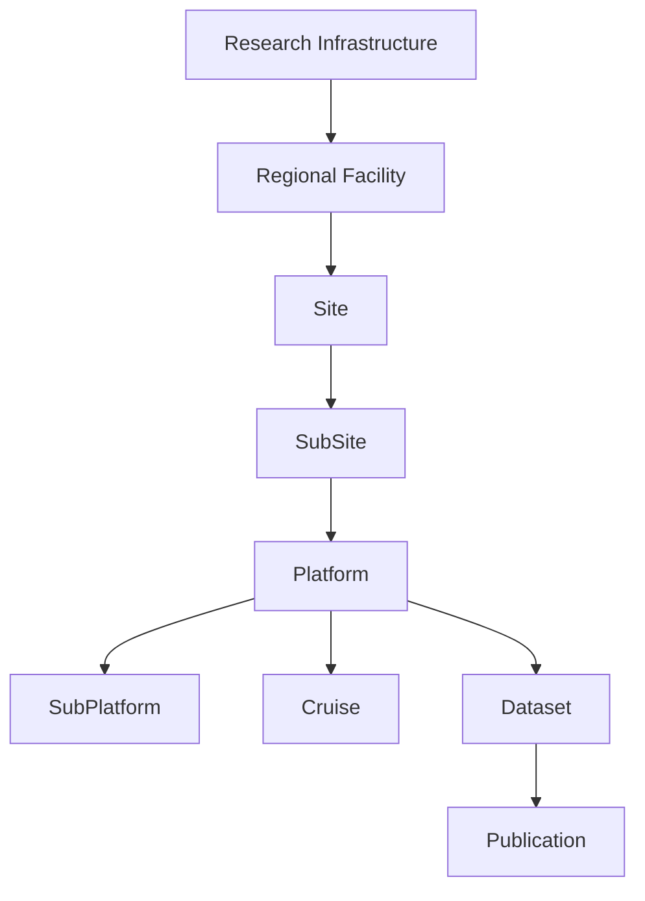

<p align="center">
  
</p>

<h1 align="center">
Observatories of the Seas Ontology (OSO)
</h1>

<p align="center">
A FAIR ontology for marine observatories, ocean observation systems and marine research infrastructures.
</p>

<p align="center">


</p>

---

# Why OSO?

The **Observatories of the Seas Ontology (OSO)** provides a FAIR semantic framework for describing marine observatories, ocean observation systems, research infrastructures, observing platforms, scientific campaigns and associated organisations.

OSO facilitates semantic interoperability between marine data infrastructures by promoting reusable identifiers, standard vocabularies and Linked Open Data principles.

The ontology has been developed within the **EMSO Data Management Service Group (DMSG)** and is intended for use by the wider marine science community.

---

# FAIR by Design

OSO has been designed according to FAIR and Linked Open Data principles.

| FAIR Feature | Status |
|---------------|:------:|
| Persistent ontology IRI (w3id) | ✅ |
| Zenodo DOI | ✅ |
| FAIRsharing registration | ✅ |
| EarthPortal publication | ✅ |
| Linked Open Vocabularies (LOV) | ✅ |
| GitHub Pages documentation | ✅ |
| Public SPARQL endpoint | ✅ |
| DCAT metadata | ✅ |
| VoID description | ✅ |
| JSON-LD distribution | ✅ |
| Multilingual annotations | ✅ |
| Provenance metadata | ✅ |

---

# Ontology Overview



---

# Quick Access

| Resource | Link |
|-----------|------|
| Persistent ontology IRI | https://w3id.org/earthsemantics/OSO |
| Documentation (Widoco) | https://emso-eric.github.io/oso-ontology/ |
| EarthPortal | https://earthportal.eu/ontologies/OSO |
| SPARQL Endpoint | https://virtuoso.ifremer.fr/oso/sparql |
| GitHub Repository | https://github.com/emso-eric/oso-ontology |
| Zenodo | https://doi.org/10.5281/zenodo.19497913 |
| FAIRsharing | https://doi.org/10.25504/FAIRsharing.654931 |
| LOV | https://lov.linkeddata.es/dataset/lov/vocabs/oso |

---

# Downloads

The latest release is available in several RDF serialisation formats.

| File | Description |
|------|-------------|
| `OSO.ttl` | Turtle (authoritative source) |
| `OSO.owl` | RDF/XML |
| `OSO.jsonld` | JSON-LD |
| `OSO.nt` | N-Triples |
| `OSO.n3` | Notation3 |
| `OSO.trig` | TriG |
| `dcat.ttl` | DCAT metadata |
| `void.ttl` | VoID description |

---

# Repository Structure

```text
.
├── docs/              # Widoco documentation
├── images/            # Ontology figures
├── maintenance/       # Maintenance documentation
├── versions/          # Archived releases
├── .github/           # CI/CD workflows
│
├── OSO.ttl            # Authoritative ontology source
├── dcat.ttl
├── void.ttl
│
├── README.md
├── CHANGELOG.md
└── LICENSE
```

---

# Documentation

| Resource | Description |
|----------|-------------|
| `/docs` | HTML documentation generated with Widoco |
| `/maintenance` | Maintenance and release workflow |
| `/versions` | Archived ontology releases |
| `/images` | Images and diagrams used throughout the ontology |
| `CHANGELOG.md` | Release history |

---

# Example

Example describing a regional facility and one of its sites.

```turtle
:EMSOFrance
    a oso:RegionalFacility ;
    oso:containsSite :AzoresSite .

:AzoresSite
    a oso:Site .
```

---

# Citation

If you use OSO in scientific work, please cite:

> **Piel S. et al.**
> *Observatories of the Seas Ontology (OSO).*
> EMSO ERIC / Ifremer.

Persistent identifiers:

- **Ontology IRI**  
  https://w3id.org/earthsemantics/OSO

- **Zenodo DOI**  
  https://doi.org/10.5281/zenodo.19497913

- **FAIRsharing DOI**  
  https://doi.org/10.25504/FAIRsharing.654931

---

# Contributing

Contributions are welcome.

Please use:

- GitHub Issues
- Pull Requests

Development and release procedures are documented in:

```
maintenance/
```

---

# License

This project is distributed under the **Creative Commons Attribution 4.0 International (CC BY 4.0)** license.

https://creativecommons.org/licenses/by/4.0/

---

# Acknowledgements

OSO is collaboratively developed by the **EMSO Data Management Service Group (DMSG)** with contributions from the EMSO ERIC community, Ifremer and partner organisations.

---

<p align="center">

Developed collaboratively by the EMSO Data Management Service Group (DMSG) to promote FAIR and interoperable marine knowledge.

</p>
