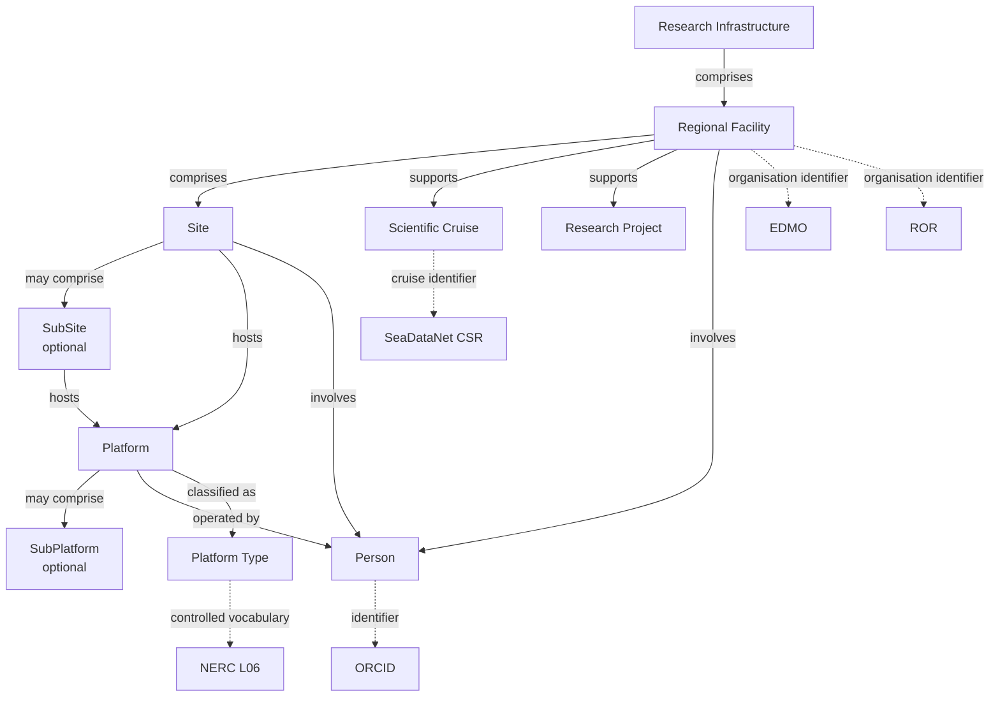

<h1 align="center">
Observatories of the Seas Ontology (OSO)
</h1>

<p align="center">
<b>A FAIR, multilingual and interoperable ontology for marine observatories, ocean observing systems and marine research infrastructures.</b>
</p>

<p align="center">
  
</p>

<p align="center">
OSO enables semantic interoperability across marine observatories, ocean observing systems and research infrastructures by connecting organisations, observatories, platforms, projects, scientific campaigns and datasets using Linked Open Data principles.
</p>

---

<b>🌐 Persistent IRI</b>&nbsp;
<a href="https://w3id.org/earthsemantics/OSO">
https://w3id.org/earthsemantics/OSO
</a>

<b>📦 Publish &amp; Cite</b>&nbsp;
<a href="https://github.com/emso-eric/oso-ontology"></a>
<a href="https://github.com/emso-eric/oso-ontology/releases"></a>
<a href="https://doi.org/10.5281/zenodo.19497913"></a>
<a href="https://creativecommons.org/licenses/by/4.0/"></a>
<br>

<b>🔎 Discover</b>&nbsp;&nbsp;&nbsp;&nbsp;&nbsp;&nbsp;&nbsp;&nbsp;
<a href="https://earthportal.eu/ontologies/OSO"></a>
<a href="https://lov.linkeddata.es/dataset/lov/vocabs/oso"></a>
<a href="https://doi.org/10.25504/FAIRsharing.654931"></a>
<br>

<b>📚 Explore</b>&nbsp;&nbsp;&nbsp;&nbsp;&nbsp;&nbsp;&nbsp;&nbsp;&nbsp;&nbsp;
<a href="https://emso-eric.github.io/oso-ontology/"></a>
<a href="https://service.tib.eu/webvowl/#iri=https://w3id.org/earthsemantics/OSO"></a>
<a href="https://virtuoso.ifremer.fr/oso/sparql"></a>
<br>

<b>🌐 Standards</b>&nbsp;&nbsp;&nbsp;&nbsp;&nbsp;&nbsp;&nbsp;&nbsp;
<a href="https://www.w3.org/RDF/" target="_blank"></a>
<a href="https://www.w3.org/TR/owl2-overview/" target="_blank"></a>
<a href="https://www.w3.org/TR/skos-reference/" target="_blank"></a>
<a href="https://www.w3.org/TR/vocab-dcat-3/" target="_blank"></a>
<a href="https://www.w3.org/TR/void/" target="_blank"></a>
<a href="https://opengeospatial.github.io/ogc-geosparql/" target="_blank"></a>
<a href="https://xmlns.com/foaf/spec/" target="_blank"></a>
<a href="https://www.w3.org/TR/prov-o/" target="_blank"></a>
<a href="https://www.w3.org/TR/vcard-rdf/" target="_blank"></a>
<a href="https://semiceu.github.io/ADMS/releases/2.00/" target="_blank"></a>

<b>📄 Formats</b>&nbsp;&nbsp;&nbsp;&nbsp;&nbsp;&nbsp;&nbsp;&nbsp;&nbsp;
<a href="https://github.com/emso-eric/oso-ontology/blob/main/versions/1.1.0/OSO.jsonld"></a>
<a href="https://github.com/emso-eric/oso-ontology/blob/main/versions/1.1.0/OSO.ttl"></a>
<a href="https://github.com/emso-eric/oso-ontology/blob/main/versions/1.1.0/OSO.nt"></a>
<a href="https://github.com/emso-eric/oso-ontology/blob/main/versions/1.1.0/OSO.n3"></a>
<a href="https://github.com/emso-eric/oso-ontology/blob/main/versions/1.1.0/OSO.trig"></a>
<a href="https://github.com/emso-eric/oso-ontology/blob/main/versions/1.1.0/OSO.owl"></a>

<b>🚀 Next Steps</b>&nbsp;&nbsp;&nbsp;&nbsp;&nbsp;&nbsp;
<a href="https://www.w3.org/TR/vocab-ssn/"></a>
<a href="https://i-adopt.github.io/"></a>
<a href="https://www.w3.org/TR/shacl/"></a>

---

# Why OSO?

The **Observatories of the Seas Ontology (OSO)** is a FAIR, multilingual ontology that provides a common semantic model for marine observatories, ocean observing systems and marine research infrastructures.

It enables organisations to describe and interlink infrastructures, observing sites, platforms, scientific campaigns, datasets and people using persistent identifiers, Linked Open Data principles and internationally recognised standards.

Originally developed within the **EMSO Data Management Service Group (DMSG)**, OSO is designed as an open and reusable ontology for the global marine science community.

---

# FAIR by Design

OSO has been designed from the outset according to FAIR and Linked Open Data principles.

| **🟦 Findable**            | **🟩 Accessible**         | **🟨 Interoperable**     | **🟥 Reusable**    |
| :---------------------- | :--------------------- | :-------------------- | :-------------- |
| Persistent IRI (w3id) | SPARQL endpoint         | RDF / OWL / SKOS      | CC BY 4.0            |
| Versioned DOI         | GitHub repository       | GeoSPARQL             | Provenance           |
| EarthPortal           | HTML documentation      | DCAT / VoID           | Rich Multilingual annotations        |
| FAIRsharing           | Multiple RDF formats    | NERC Vocabularies     | ORCID attribution         | 
| LOV                   | GitHub Releases         | ROR / EDMO            | Community governance |
|                       |                         | SeaDataNet CSR        |                      |
|                       |                         | Wikidata              |                      |


OSO addresses all four FAIR principles (Findable, Accessible, Interoperable and Reusable) through persistent identifiers, semantic web standards, rich metadata and open dissemination.

OSO has also been independently evaluated using the **[O'FAIRe](https://github.com/agroportal/fairness)** (Ontology FAIRness Evaluator) framework, which provides an objective assessment of ontology FAIRness. The evaluation details are publicly available from the **[OSO EarthPortal page](https://earthportal.eu/ontologies/OSO)**.

Together, these features make OSO a FAIR, interoperable and reusable ontology for marine observatories, ocean observing systems and marine research infrastructures.

---

# Ontology Overview



---

# Essential Links

| Resource | Link |
|-----------|------|
| Persistent ontology IRI | https://w3id.org/earthsemantics/OSO |
| Documentation (Widoco) | https://emso-eric.github.io/oso-ontology/ |
| EarthPortal | https://earthportal.eu/ontologies/OSO |
| SPARQL Endpoint | https://virtuoso.ifremer.fr/oso/sparql |
| GitHub Repository | https://github.com/emso-eric/oso-ontology |
| Zenodo | https://doi.org/10.5281/zenodo.19497913 |
| FAIRsharing | https://doi.org/10.25504/FAIRsharing.654931 |
| LOV | https://lov.linkeddata.es/dataset/lov/vocabs/oso |

---

# Downloads

The latest release is available in several RDF serialisation formats.

| File | Description |
|------|-------------|
| `OSO.ttl` | Turtle (authoritative source) |
| `OSO.owl` | RDF/XML |
| `OSO.jsonld` | JSON-LD |
| `OSO.nt` | N-Triples |
| `OSO.n3` | Notation3 |
| `OSO.trig` | TriG |
| `dcat.ttl` | DCAT metadata |
| `void.ttl` | VoID description |

---

# Repository Structure

```text
.
├── docs/              # Widoco documentation
├── images/            # Ontology figures
├── maintenance/       # Maintenance documentation
├── versions/          # Archived releases
├── .github/           # CI/CD workflows
│
├── OSO.ttl            # Authoritative ontology source
├── dcat.ttl
├── void.ttl
│
├── README.md
├── CHANGELOG.md
└── LICENSE
```

---

# Documentation

| Resource | Description |
|----------|-------------|
| `/docs` | HTML documentation generated with Widoco |
| `/maintenance` | Maintenance and release workflow |
| `/versions` | Archived ontology releases |
| `/images` | Images and diagrams used throughout the ontology |
| `CHANGELOG.md` | Release history |

---

# Example

Example describing a regional facility and one of its sites.

```turtle
:EMSOFrance
    a oso:RegionalFacility ;
    oso:containsSite :AzoresSite .

:AzoresSite
    a oso:Site .
```

---

# Citation

If you use the **Observatories of the Seas Ontology (OSO)** in research, publications or software, please cite:

> Piel, S. & EMSO Data Management Service Group (DMSG). (2026). *Observatories of the Seas Ontology (OSO)* (Version 1.1.0). EMSO ERIC. https://doi.org/10.5281/zenodo.19497913

**Persistent ontology IRI**

https://w3id.org/earthsemantics/OSO

For citation metadata compatible with GitHub and reference managers, see the [`CITATION.cff`](CITATION.cff) file.

---

# Contributing

Contributions are welcome.

Please use:

- GitHub Issues
- Pull Requests

Development and release procedures are documented in:

```
maintenance/
```

---

# License

This project is distributed under the **Creative Commons Attribution 4.0 International (CC BY 4.0)** license.

https://creativecommons.org/licenses/by/4.0/

---

# Acknowledgements

OSO is collaboratively developed by the **EMSO Data Management Service Group (DMSG)** with contributions from the EMSO ERIC community, Ifremer and partner organisations.
