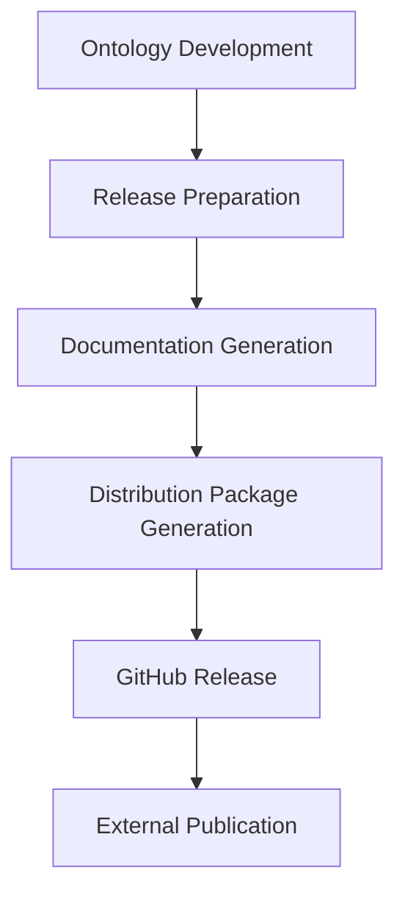

# OSO Release Workflow

## Purpose

This document describes the complete workflow followed to prepare, validate and publish a new release of the **Observatories of the Seas Ontology (OSO)**.

The workflow currently combines manual and automated tasks. One of its primary objectives is to progressively migrate towards a fully reproducible Continuous Integration and Continuous Deployment (CI/CD) pipeline.

Each phase describes:

- its objective;
- the required inputs;
- the expected outputs;
- the software tools involved;
- its current level of automation.

## Workflow overview

The OSO release workflow is organised into the following phases:

1. Ontology development
2. Release preparation
3. Documentation generation
4. Distribution package generation
5. GitHub release
6. External publication

| Phase | Purpose | Current status | CI/CD target |
|------|---------|----------------|--------------|
| 1 | Ontology development | Manual | Manual |
| 2 | Release preparation | Manual | Automated |
| 3 | Documentation generation | Semi-manual | Automated |
| 4 | Distribution package generation | Semi-manual | Automated |
| 5 | GitHub release | Manual | Automated |
| 6 | External publication | Manual | Partially automated |

## Prerequisites

The following software is currently required to perform a complete OSO release:

- Git
- GitHub
- VSCodium
- Protégé
- Java
- Widoco
- Python
- RDFLib

## Terminology

### Source ontology

The authoritative OSO ontology maintained as the Turtle source file (`OSO.ttl`).

### Ontology metadata

Version information, release dates, ontology statistics and descriptive metadata embedded directly in the ontology.

### Distribution artefacts

RDF serialisations and metadata files automatically generated from the source ontology.

### Documentation artefacts

Human-readable documentation generated by Widoco and published through GitHub Pages.

### Release artefacts

The complete set of files published for a given OSO release.

### Release workflow

The sequence of activities required to prepare, validate, package and publish a new OSO release.

### CI/CD pipeline

The future automated workflow intended to progressively replace manual release tasks while ensuring reproducibility, traceability and quality assurance.

## Phase 1 – Ontology Development

### Objective

Develop, modify and maintain OSO while ensuring semantic consistency and ontology engineering best practices.

### Inputs and outputs

| Inputs | Outputs |
|---|---|
| Previous OSO version | Updated `OSO.ttl` |
| Change requests | Updated metadata |
| Ontology engineering expertise | Valid Turtle syntax |

### Software tools

| Tool | Role |
|---|---|
| VSCodium | Primary editor |
| Protégé | Validation, browsing and metrics |
| Git | Version control |

> **Important**
>
> The authoritative source of OSO is `OSO.ttl`. Development is performed directly in Turtle using VSCodium. Protégé is primarily used for validation and analysis.

### Activities

- Develop ontology content.
- Update classes, properties and individuals.
- Improve multilingual annotations.
- Align with external vocabularies.
- Maintain persistent URIs.
- Update ontology metadata when required.

### Validation

Verify Turtle syntax, Protégé parsing, modelling consistency, annotations, metadata and external references.

### Automation potential

| Activity | Automation |
|---|---|
| Ontology modelling | ❌ Manual |
| Syntax validation | ✅ Possible |
| Metadata verification | ✅ Possible |
| URI verification | ✅ Possible |
| External link checking | ✅ Possible |

## Phase 2 – Release Preparation

### Objective

Prepare the ontology for publication by updating metadata, version information and embedded statistics.

### Inputs and outputs

| Inputs | Outputs |
|---|---|
| Validated `OSO.ttl` | Release-ready ontology |
| Release version | Updated metadata |
| Statistics | Updated statistics |

### Activities

#### 2.1 Update ontology metadata

Update ontology version, `owl:versionIRI`, `owl:versionInfo`, release date, modification date and contributors.

#### 2.2 Update embedded ontology statistics

Recompute all embedded metrics (`mod:maxDepth`, OMV metrics, `void:triples`, `void:entities`).

### Validation

Verify metadata consistency, version identifiers, dates and statistics.

### Automation potential

| Activity | Automation |
|---|---|
| Metadata update | ✅ High |
| Statistics computation | ✅ High |
| Consistency verification | ✅ High |

## Phase 3 – Documentation Generation

### Objective

Generate and publish the human-readable ontology documentation.

### Inputs and outputs

| Inputs | Outputs |
|---|---|
| Release-ready ontology | `/docs` |
| Widoco configuration | GitHub Pages |

### Software tools

| Tool | Role |
|---|---|
| Widoco | Documentation generation |
| Java | Widoco runtime |
| Git | Publication |

### Activities

- Generate documentation with Widoco.
- Verify generated pages, diagrams and WebVOWL.
- Publish `docs/` to GitHub Pages.

### Validation

Verify generated resources, links and published documentation.

### Automation potential

| Activity | Automation |
|---|---|
| Widoco execution | ✅ High |
| Publication | ✅ High |
| Link checking | ✅ High |

## Phase 4 – Distribution Package Generation

### Objective

Generate all distribution artefacts required for publication.

### Inputs and outputs

| Inputs | Outputs |
|---|---|
| Release-ready ontology | RDF serialisations |
| RDFLib scripts | DCAT / VoID |
| | Archived version |

### Software tools

| Tool | Role |
|---|---|
| RDFLib | RDF serialisations |
| Python | Generation scripts |
| Git | Publication |

### Activities

- Generate RDF/XML, JSON-LD, N-Triples, N3 and TriG.
- Update `dcat.ttl` and `void.ttl`.
- Archive the release under `versions/x.x.x/`.
- Validate generated artefacts.

### Validation

Verify all artefacts, RDF validity and archive completeness.

### Automation potential

| Activity | Automation |
|---|---|
| RDF generation | ✅ High |
| Metadata generation | ✅ High |
| Archive creation | ✅ High |

## Phase 5 – GitHub Release

### Objective

Publish the official release on GitHub.

### Inputs and outputs

| Inputs | Outputs |
|---|---|
| Distribution artefacts | Git tag |
| Documentation | GitHub Release |
| Release notes | Published repository |

### Activities

- Commit release artefacts.
- Create Git tag.
- Create GitHub Release.
- Publish repository.

### Validation

Verify repository, tag, release and GitHub Pages.

### Automation potential

| Activity | Automation |
|---|---|
| Git tag | ✅ High |
| GitHub Release | ✅ High |
| Publication | ✅ High |

## Phase 6 – External Publication

### Objective

Publish the release to external repositories and archives.

### Inputs and outputs

| Inputs | Outputs |
|---|---|
| GitHub Release | EarthPortal |
| Distribution artefacts | Zenodo |
| Metadata | LOV |

### Activities

- Publish to EarthPortal.
- Publish to Zenodo.
- Register in LOV.
- Verify publication consistency.

### Validation

Verify that all platforms reference the same release and expose consistent metadata.

### Automation potential

| Activity | Automation |
|---|---|
| EarthPortal | ⚠️ Partial |
| Zenodo | ✅ High |
| LOV | ⚠️ Partial |
| Metadata verification | ✅ High |

## CI/CD Roadmap

The long-term objective is to automate as many release tasks as possible while preserving reproducibility, traceability and quality assurance.

| Priority | Candidate for automation |
|---|---|
| High | Metadata update |
| High | Statistics computation |
| High | RDF serialisation generation |
| High | Widoco documentation |
| High | RDF validation |
| High | GitHub Release |
| Medium | Zenodo publication |
| Medium | EarthPortal publication |
| Low | LOV publication |

The GitHub repository is intended to become the central entry point of the release workflow, with external repositories progressively synchronised through automated CI/CD processes.

Ultimately, the complete release workflow should be executable from a single GitHub Actions workflow triggered by the creation of a new release.
